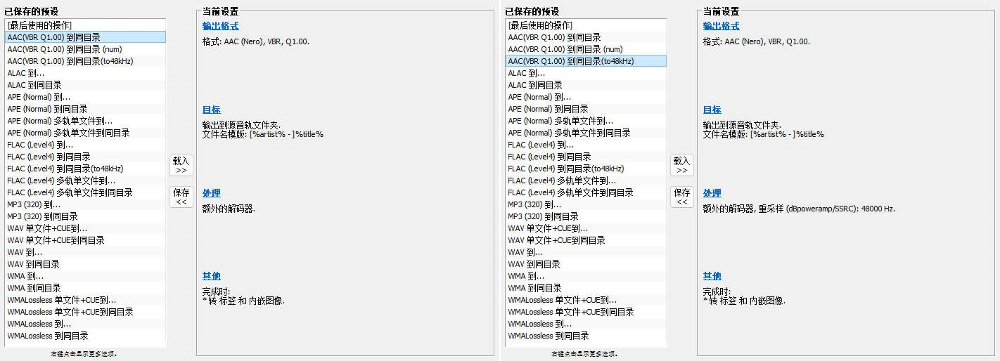
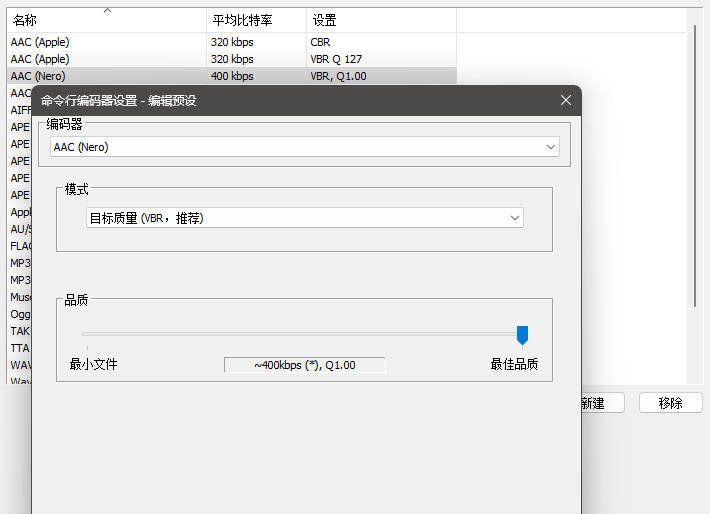
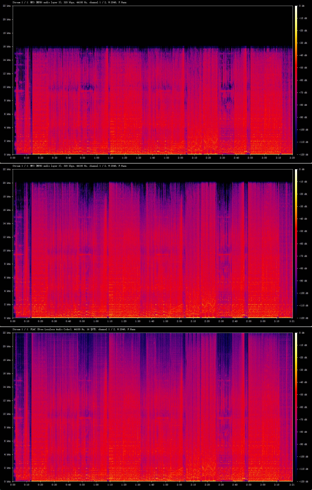
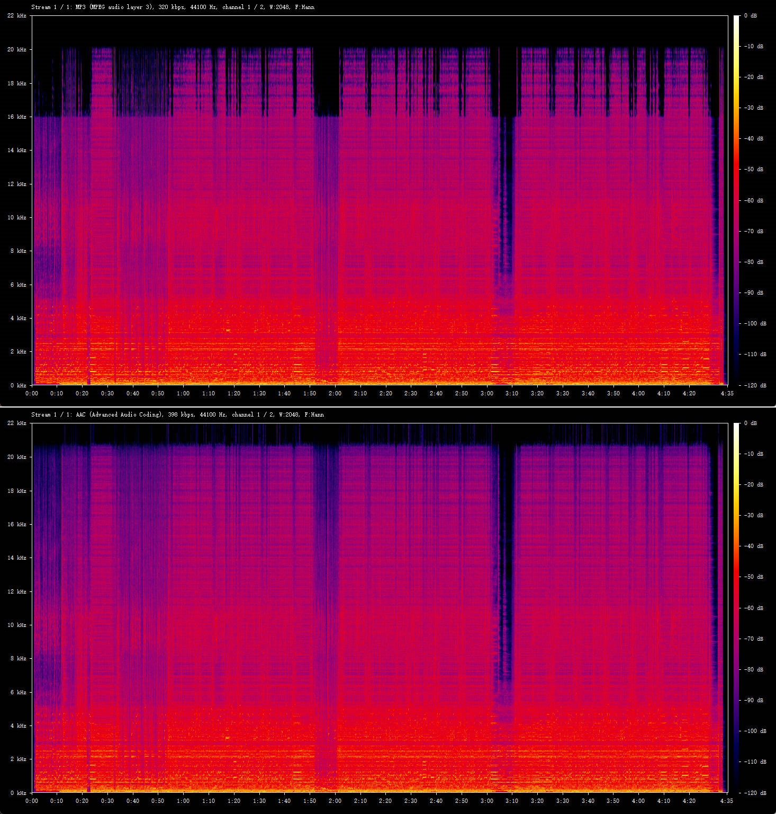
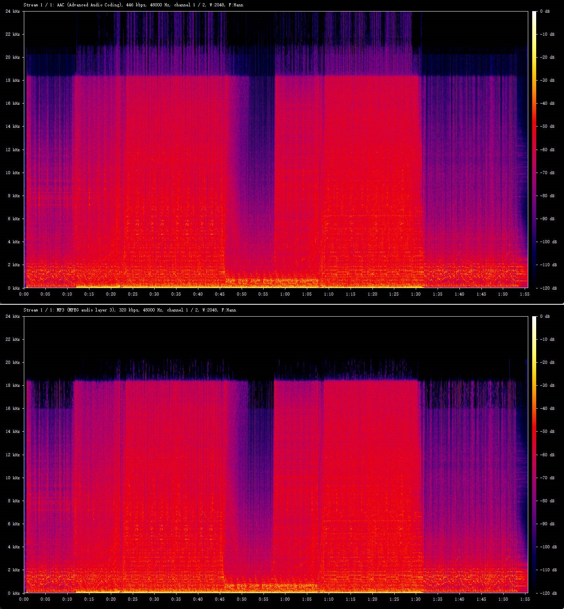

作为一个在移动互联网兴起之前便常常混迹于各种论坛或BT分享站中寻找各类 ACG 资源下载的，不敢自称老至少不算年轻的网民，自打从家里有了电脑以来便一直有着维护本地曲库的习惯，每当在网络上什么地方听到对胃口的歌时，都会尽量想办法找到高音质 mp3 文件下回来存到电脑硬盘以及后来的各种移动设备当中。早年间还没有重视起版权和流媒体概念时，很多 mp3 都下载自酷我、网易云这些网络音乐软件，由于文件来源鱼龙混杂，假码率、假无损的情况非常常见，一个无损或 320k mp3 内部其实是 128k 质量并不奇怪。十多年以来我都没有太在意过这个问题，因为自己的设备水平一直以来都比较低端，听歌的频率也低，连无损都是两三年前才开始收的，直到现在上班听歌比较多和最近几个月对自己的音频设备进行了一波升级，与此同时找到了一些无损资源途径，我想现在正是直面这个老问题的最佳时机了——是时候对本地音源进行全面的音质检查升级了！

<!--more-->

### 无损 or 有损？

我们首先跳过资源从哪里获取的话题，毕竟公开分享盗版不是啥好行为，相信还在当本地仓鼠党的都是老油条了。而且现在流媒体资源非常丰富，mora、OTOTOY 等网站上也可以很方便地购买到无 DRM 的正版无损音源，一次购买终身使用不像某些订阅制平台下载了也只能在会员开通期间听，当然价格也不是一个等级的。

好了，下到了喜欢的歌的无损音源之后，就这么直接丢进曲库文件夹里面就完事了吗？对于我来说，这不行，因为太大了。一首典型 CD 抓轨无损大小是 320k 的 3 倍，如果是 Hi-Res 源，取决于采样率不同体积会到 5 倍、10 倍去。虽然在 2024 年的现在，存储成本几乎已经不配被算作成本了，但是积少成多，加上我有一个曲库多处存储的需要（主力 PC 一份、手机上一份、移动硬盘上一份），如果文件体积从 MB 单位级变成了 GB 单位级的膨胀速度，移动设备存储会先顶不住，传输维护起来也会相当地噩梦。因此，除了一些特别喜欢的曲子会留下无损以外，大多数音源我都需要转换为体积性价比更高的有损格式。

但是，选择有损不代表着对音质的放弃，我的目标是在音质和体积之间寻找到一个良好的平衡点，否则未来我终将还会再重复一遍现在在做的事情。mp3 并非是一个优秀的有损音频格式，这点在音频领域中算是一个常识，只是其作为一个先发的老格式拥有着压倒性的流行度和兼容度。但是谁才是最好的有损压缩格式并无定论，aac、ogg、opus 等在不同的码率等级和内容取向上各有优劣，而且大多数对有损格式的对比研究文章都侧重在 256k 及以下的中低码率下的对比。总之，最终在屈指可数的论坛帖子、知乎、以及一些博客文章的综合调研之后，我的选择是 Nero AAC `vbr -q 1.00` 作为我的无损转有损目标格式。这里比较推荐的文章是《[256K,320K及以上Nero AAC,QAAC,FAAC,MP3,OGG等主流有损音频格式横评](https://blog.csdn.net/w504430863/article/details/100762358)》，是我能找到的对于高码率有损实验数据和结论写的最好的一篇中文文章，文章最后的结论推荐也是 qaac tvbr 或者 Nero AAC vbr，在同等码率条件下苹果的 qaac 质量更好，但是 Nero 的上限更高，可以用 400~k 的高码率换取更小的损失，也就是用 CD 无损的一半体积换取到非常接近无损的质量，这是比较符合我的需求的。

除了上述以频谱图作为分析维度的文章，这个以失真率等进行分析的日语博客也有很高的参考价值：《[ハイレゾ音源をAAC（MP3）に変換する時の「５つのヒント」](https://pianoforte32.com/hints-for-converting-high-resolution-audio-to-aac-or-mp3/)》，比较可惜的是这位的测试只着重在 320k 而没有更高码率的测试数据。根据这篇文章，我们可以知道对于高于 48kHz 的音源，如果直接转换为 aac 将会导致输出质量的大幅下滑，加上 20kHz 以上的声音理论上人耳已经听不到了，所以像 96kHz 这类音源在转换之前需要重采样回 48kHz 以达到最优的效果同时也可以减少不必要的体积。此外这里也提到了编码器的位深支持问题，同样是 aac 有的编码器只支持到 16bit，并且也测试给出了一些编码器的结果，可惜其中没有 Nero，所以我自己按照他给的方法测试了一下，Nero 是支持 24bit 的不用担心这个问题（事实上 Nero 的官方文档上写过最高支持 32bit 浮点的输入，只是这个说法有点暧昧）。不过我用 Poweramp 播放时显示 aac 都是 16bit，有点不太懂。

转换使用的软件自然是 foobar2000，添加编码器的教程可以参考《[foobar2000 を使い、音声ファイルを MP3 / FLAC / AAC（M4A）/ ALAC（M4A） / OGG / OPUS / WV / MPC に変換できるようにするエンコーダーパック「foobar2000 Free Encoder Pack」](https://www.gigafree.org/music-player/foobar2000-free-encoder-pack/)》，这里不再赘述。以下是我常用的编码转换配置：

### 低码率音源升级替换

好了，现在新下载的音源都已经找到妥善的处理方案了，接下来就是更加累人的，找出本地曲库中的低码率文件并替换。前面虽然说过 mp3 并非优秀的格式，但基于优良编码器的 320k mp3 质量依然是很高的，所以 320k mp3 对我来说依然是可以接受的，在没有更好的音源的情况下能找到 320k mp3 已经足够令人满意。不过低于 320k 的，在我现在的设备下已经存在非常明显的听感差异了，这次要升级替换掉的目标便是这些文件。

字面码率低的很好找，foobar2000 导入媒体库之后按码率升序一排就完事了。麻烦的在于如何识别本文开头就提到过的假码率文件，在此首先我先小声谩骂一句所有生产假码率文件的人，纯纯的损人行为。识别单个音源是否是假码率，说简单也简单说难也难，目前最流行的方法就是看频谱图。假如你手上没有方便看频谱图的软件，那么可以下载一个 [Spek](https://www.spek.cc/p/download) ，安装完打开软件，将音频文件拖进去就生成完毕了。由于低码率有损压缩（主要是 mp3，会做假码率的大多也是用 mp3 升上来的）通常会优先丢弃高频信息，甚至有时会直接一刀切全部不要，所以只需要观察频谱图是否在某个高频段之后，一般是 16k 以上，频谱产生了非常突然且大面积的衰减甚至消失，就能大概判断出是否为实际低码率的了。高码率有损至少会保证 20kHz 以内的信息尽可能被保留，因此我认为如果消失线在 19kHz 及以下时，就该怀疑音源质量了。除了假码率外，我猜跟编码器的类型也有关，质量较差的编码器也许也会导致高频信息的断崖式减少，因为假码率更多的是特定频率之上一刀切全部消失的，如果只是变弱似乎是这种原因的可能性更大一些，这个我没试验过，纯属猜测，反正从频谱图上看来质量都算不上好。

> 同一首歌的频谱图，从上到下分别为假码率 320k mp3、真 320k mp3、无损

> 同一首歌来源不明的 320k mp3 和无损压制出来的 aac。另一种情况，16kHz 以上明显少了很多信息。

然而难的地方在于，这种方法得出来的终究只能是猜测，因为有些音源可能母带出来的时候就真的没有高频信息。比如下面这首：

> 上方为无损压制 aac 频谱，和无损的频谱差不多，18kHz 一条直线信息量骤降，很有迷惑性。下方为前者再压制出的 320k mp3，高频信息再度减少，更容易判断为假码率。

此时只能找到可信的无损音源才能知道真伪了。如果曲库中有这种歌我只能说自认倒霉吧，盗版的代价总是要支付的，毕竟正版音源就没必要考虑这个问题了。

假无损的判断也是类似的，看 20kHz 以上是否有数据就行了，绝大多数 mp3 都是 20kHz 上限一刀切的，当然问题是同样的，不排除母带本身就处理过的可能。

Spek 查看频谱图虽然很方便，但它并不支持批量处理，如果要检查成百上千个音频文件的频谱图总不可能手动一个个拉进去看，效率太低了。早在十多年前就有 Spek 的 [issue](https://github.com/alexkay/spek/issues/9) 提过批量处理功能，可是一直没能够实现，不过 ffmpeg 也提供了频谱图生成功能，虽然没有 Spek 那么好看，但至少能实现批量生成了。为此我让 chatGPT 写了一个 Powershell 脚本，用于批量生成指定目录下的音频文件频谱图，[地址在这](https://gist.github.com/VonXXGhost/a2f2a334cc65c6bbd90daff6b50ba542)。脚本前三行分别是目标文件后缀名、要扫描的文件夹路径（不包含子目录）、频谱图输出路径，按需修改下就行。另外 ffmpeg 需要更新到最新版本，至少我发现 2019 年的版本按脚本的参数生成出来的频谱图会丢失相当多高频区域。

频谱图生成出来后，在图片浏览软件里检查速度就很快了，我相信看多了之后你的眼睛会先遭不住……这已经是我目前能想到的最优方案了，虽然按理说写个音频文件分析脚本判断衰减频率在哪不会特别难，但我对音频处理领域了解很少，也没那么多时间写这种逻辑复杂的代码，就只能牺牲下眼睛了>.<…

以上就是我这几个月折腾音频文件的一些经验分享了，感觉如今像我这样当个本地党对音质有点要求又不想收太多无损的人应该非常少了，希望这篇能给后来者一些微薄的经验。好了，该回去 Spotify 继续听那可怜的 128k aac 了。
